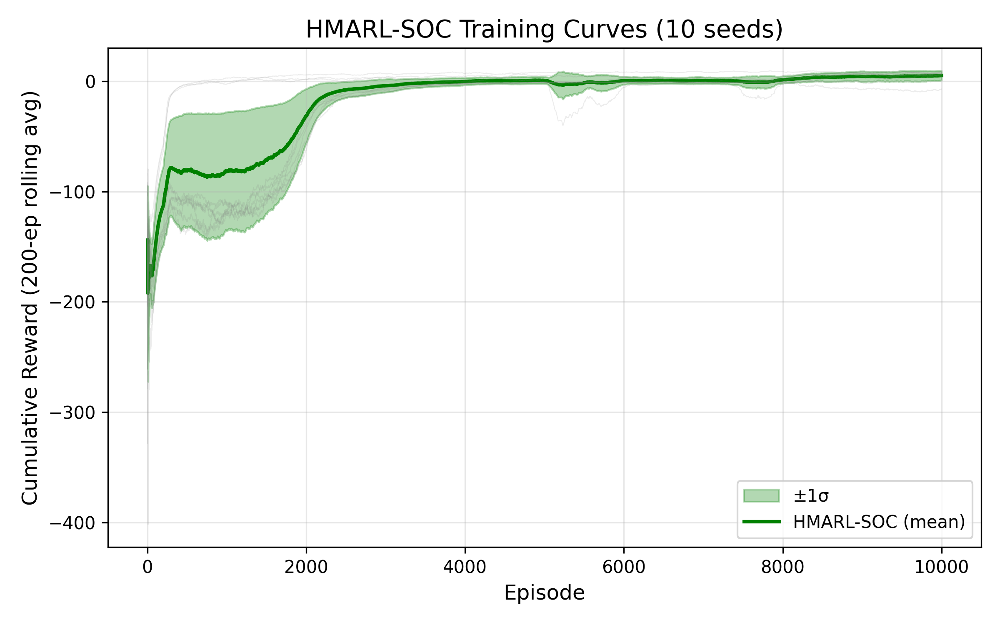
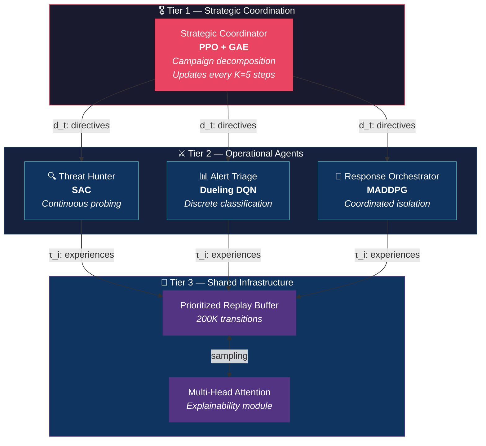
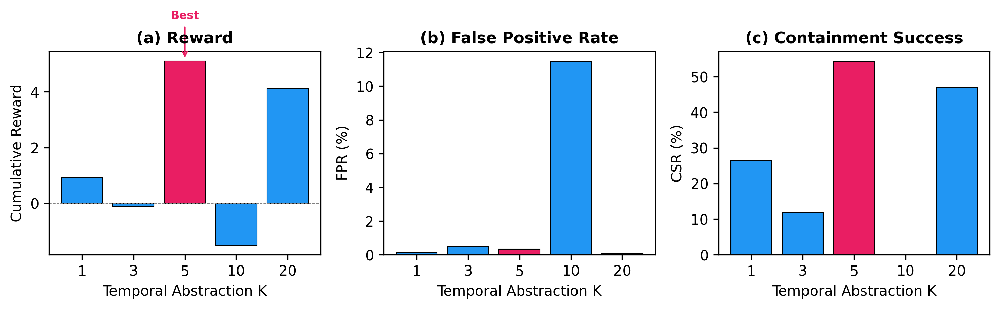

<div align="center">

# 🛡️ HMARL-SOC

### Hierarchical Multi-Agent Reinforcement Learning<br>for Autonomous Security Operations Center Coordination

[](https://colab.research.google.com/github/nutthakorn7/HMARL-SOC-journal/blob/main/code/train_colab.ipynb)
[](https://python.org)
[](https://pytorch.org)
[](https://gymnasium.farama.org)
[](https://ieeeaccess.ieee.org)
[](LICENSE)

<br>

*Extended version of our [ITC-CSCC 2026 conference paper](https://github.com/nutthakorn7/HMARL-SOC) — submitted to IEEE Access*

<br>



<br>

**SOCs face 10,000+ events/hour. Analysts can handle fewer than half.**<br>
**HMARL-SOC automates the entire SOC pipeline — achieving 0.17% false positive rate.**

</div>

---

## 🏗️ Architecture

The framework mirrors real SOC team structure with **three specialized tiers**, each using the RL algorithm best suited to its action space:



---

## 📊 Key Results

<div align="center">

Performance on a **200-host, 5-segment MITRE ATT&CK simulator** (mean ± std, 5 seeds)

| | Reward ↑ | MTTD ↓ | MTTR ↓ | FPR % ↓ | CSR % ↑ |
|:---|:---:|:---:|:---:|:---:|:---:|
| Rule-SOAR | −1238.2±26.6 | **8.0**±0.1 | 136.9±3.1 | 5.14±0.01 | 35.2±1.8 |
| Single-DRL | −336.5±34.0 | 10.9±1.4 | 95.1±12.3 | 2.97±0.28 | 65.0±7.3 |
| IQL | +1.8±4.7 | 22.8±18.3 | 91.9±56.7 | 0.22±0.23 | 67.8±29.8 |
| MAPPO | −292.2±12.6 | 8.8±0.1 | 78.6±0.9 | 2.52±0.04 | 69.7±0.6 |
| QMIX | −99.3±66.3 | 8.2±0.2 | **63.4**±32.4 | 1.03±0.02 | **77.5**±18.6 |
| **🏆 HMARL-SOC** | **+6.9**±1.0 | 16.8±5.3 | 93.2±21.3 | **0.17**±0.08 | 71.0±10.4 |

</div>

> [!IMPORTANT]
> **HMARL-SOC achieves the lowest FPR (0.17%)** — a **6× reduction** vs QMIX and **15× vs MAPPO** — while maintaining the highest cumulative reward, reflecting the best overall balance.

### 🎛️ K-Sensitivity Analysis

<div align="center">


*The Strategic Coordinator's temporal abstraction factor **K=5** is optimal.<br>K=1 overwhelms agents with rapid directive changes. K=10+ reacts too slowly to threats.*
</div>

---

## 🚀 Quick Start

```bash
# Clone & install
git clone https://github.com/nutthakorn7/HMARL-SOC-journal.git
cd HMARL-SOC-journal/code
pip install -r requirements.txt

# 🏋️ Train HMARL-SOC
python train.py --config configs/default.yaml --episodes 10000 --seed 42

# 🆚 Train all baselines
python train_baselines.py --episodes 10000 --seeds 42 123 456 789 1024

# 📈 Evaluate
python evaluate.py --checkpoint checkpoints/checkpoint_best.pt --episodes 2000

# 🎨 Reproduce paper figures
python generate_figures.py
```

> [!TIP]
> **No GPU?** Use [Google Colab](https://colab.research.google.com/github/nutthakorn7/HMARL-SOC-journal/blob/main/code/train_colab.ipynb) — free T4 GPU, pre-configured environment.

---

## 📁 Project Structure

```
code/
├── 🧠 hmarl_soc/                    # Core framework
│   ├── env/
│   │   ├── soc_env.py               # Gymnasium SOC environment (Dec-POMDP)
│   │   ├── network.py               # Enterprise network (5 segments × 40 hosts)
│   │   └── attacker.py              # MITRE ATT&CK 5-phase campaign model
│   ├── agents/
│   │   ├── strategic_coordinator.py  # PPO + GAE (Tier 1)
│   │   ├── threat_hunter.py          # SAC with auto-entropy (Tier 2)
│   │   ├── alert_triage.py           # Dueling Double DQN (Tier 2)
│   │   └── response_orchestrator.py  # MADDPG (Tier 2)
│   ├── models/networks.py           # 3-layer MLP (256 hidden, ReLU)
│   └── core/
│       ├── replay_buffer.py          # Prioritized shared replay (200K)
│       └── attention.py              # Multi-head attention explainer
├── ⚡ train.py                       # Main training loop (Algorithm 1)
├── 🆚 train_baselines.py             # All baselines (Rule-SOAR → QMIX)
├── 📊 evaluate.py                    # Metrics & evaluation
├── 🎨 generate_figures.py            # Reproduce all paper figures
├── 📦 checkpoints/                   # Trained models & CSV logs
└── 📋 requirements.txt
```

---

## ⚙️ Hyperparameters

<details>
<summary><b>Click to expand full hyperparameter table</b></summary>

| Category | Parameter | Value |
|:---------|:----------|:------|
| **Environment** | Segments / Hosts | 5 / 200 |
| | Attack model | MITRE ATT&CK (5-phase) |
| **Training** | Episodes / Seeds | 10,000 / 5 |
| | Discount γ | 0.99 |
| | Batch size | 256 |
| **SC (PPO)** | LR / Clip ε / K steps | 3×10⁻⁴ / 0.2 / 5 |
| **TH (SAC)** | LR / α / target τ | 3×10⁻⁴ / 0.2 / 0.005 |
| **AT (DQN)** | ε-decay | 1.0 → 0.05 over 50K steps |
| **RO (MADDPG)** | LR / target τ | 3×10⁻⁴ / 0.005 |
| **Reward** | α, β, δ, λ | 1.0, 1.5, −0.3, −2.0 |
| **Complexity** | Per-step cost | O(N·d²) linear in agents |

</details>

---

## 📄 Citation

```bibtex
@article{chalaemwongwan2026hmarl,
  title   = {{HMARL-SOC}: Hierarchical Multi-Agent Reinforcement Learning
             for Autonomous Security Operations Center Coordination},
  author  = {Chalaemwongwan, Nutthakorn},
  journal = {IEEE Access},
  year    = {2026},
  note    = {Under review}
}
```

<details>
<summary>Conference version (ITC-CSCC 2026)</summary>

```bibtex
@inproceedings{chalaemwongwan2026hmarl_conf,
  title     = {{HMARL-SOC}: Hierarchical Multi-Agent Reinforcement Learning
               for Autonomous {SOC} Operations},
  author    = {Chalaemwongwan, Nutthakorn},
  booktitle = {Proc. ITC-CSCC},
  year      = {2026}
}
```

</details>

---

<div align="center">

**[📄 Paper](https://ieeeaccess.ieee.org) · [🐛 Issues](https://github.com/nutthakorn7/HMARL-SOC-journal/issues) · [💬 Discussions](https://github.com/nutthakorn7/HMARL-SOC-journal/discussions)**

MIT License © 2026 Nutthakorn Chalaemwongwan

</div>
